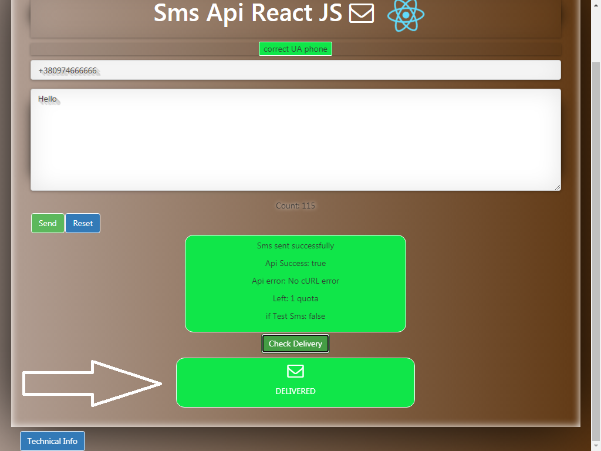

## TextBelt Api React Js

- 
A React application to send sms messages via TextBelt API.

- 
App works on React library, to run the application on <b>http://localhost:3000</b>, copy the repository code and run <b>npm install</b> to load all dependencies. 

- 
Then use <b>npm start</b> to run the app on <b>http://localhost:3000</b>.
- 
Use command <b>`npm run build`</b> to build the app for production to the `build` folder, while source code to edit is located in <b>/src</b> folder.

- 
Rename <b>.env_example</b> to <b>.env</b> and change the name of your root directory in <b>REACT_APP_APPLICATION_DIRECTORY</b> 

- 
Enter your TextBelt Api access token at <b>/Server_Side/Credentials/prod_credentials.php</b> (contact TextBelt to get one if you don't have yet)

- 
 To test on localhost, apart from above you must have PHP installed and  Web server running on your machine 

## Brief overview of application

### Autocomplete dropdown for a phone number.

### RegExp check for phone number (Ukrainian or international). 

### Control for sms text length (120 chars for Latin, 70 for Cyrillic).

### Validation for sms text input.

### Display Sms sent status.

### Sms delivery status.

### Changing wallpappers.

### Gif video.

[Watch this video on Youtube]( https://youtu.be/XyTUwoJ1mkk)

### Structure.

 Index.js --|
 
            |--- App.js ----| 
                                                  | -- <DisplayPhoneRegExpMessage/> - shows green/red message {"Vallid UA/EU phone number"}, diffrent regExp for EU/EU
                                                  
                            | -- <TextArea/> ---- | -- inputs (cell number, sms text)
                            
                            |                     |	-- <CountSmsText/> - counts sms chars left (160 or 120 based on Ru or Eng input)
                            
                            |                     | -- buttons (submit, reset)
                            
                            |                     | -- <FlashMessage/> - animated pop-up image on error
                            
                            |                     | -- <ResultFromTextbeltApi/>	-> shows all responses from Api, handles check delivery status	
                            
                            |                     | -- <AjaxLoader/> -- Shows gif spinner loader, when user clicks "Send sms"	
                            
                            |                     | -- functions_injected --> functions used in <TextAreaX/> --> Autocomplete + Validate_RegExp + sendSmsMessage
                            
                            |
                            
                            | -- <TechnicalInfo/> -- uses LiftUpComponent/<LiftedTo_Component/>
                            
                            |
                            
                            | -- <ErrorLayout/>
                            
                            |
                            
                            | -- <TopSectionButtons/> ---- functions_injected -> changeThemeInjected
                            
                            
## Available Scripts

In the project directory, you can run:

### `npm start`

Runs the app in the development mode. 
Open [http://localhost:3000](http://localhost:3000) to view it in the browser.

The page will reload if you make edits. 
You will also see any lint errors in the console.

### `npm test`

Launches the test runner in the interactive watch mode. 
See the section about [running tests](https://facebook.github.io/create-react-app/docs/running-tests) for more information.

### `npm run build`

Builds the app for production to the `build` folder. 
It correctly bundles React in production mode and optimizes the build for the best performance.

The build is minified and the filenames include the hashes. 
Your app is ready to be deployed!

See the section about [deployment](https://facebook.github.io/create-react-app/docs/deployment) for more information.

### `npm run eject`

**Note: this is a one-way operation. Once you `eject`, you can’t go back!**

If you aren’t satisfied with the build tool and configuration choices, you can `eject` at any time. This command will remove the single build dependency from your project.

Instead, it will copy all the configuration files and the transitive dependencies (Webpack, Babel, ESLint, etc) right into your project so you have full control over them. All of the commands except `eject` will still work, but they will point to the copied scripts so you can tweak them. At this point you’re on your own.

You don’t have to ever use `eject`. The curated feature set is suitable for small and middle deployments, and you shouldn’t feel obligated to use this feature. However we understand that this tool wouldn’t be useful if you couldn’t customize it when you are ready for it.

## Learn More

You can learn more in the [Create React App documentation](https://facebook.github.io/create-react-app/docs/getting-started).

To learn React, check out the [React documentation](https://reactjs.org/).
